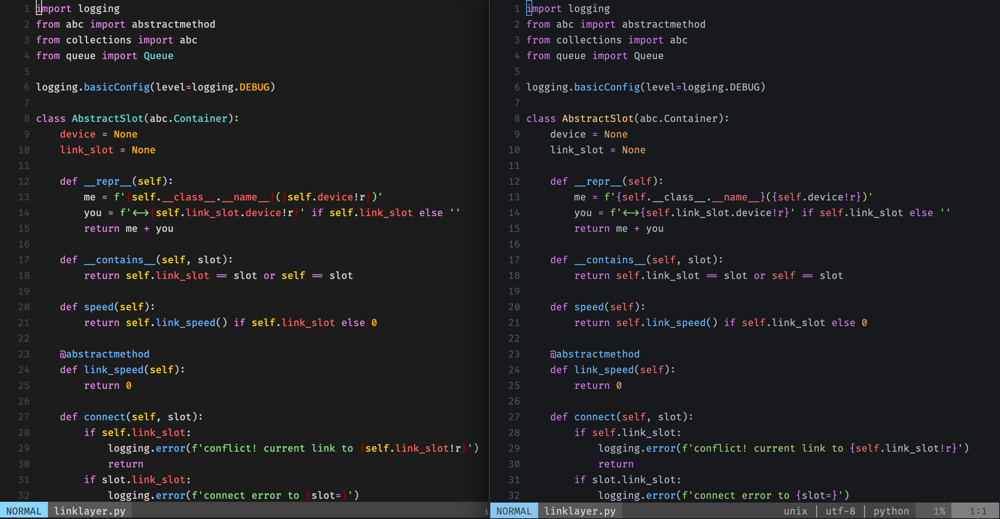
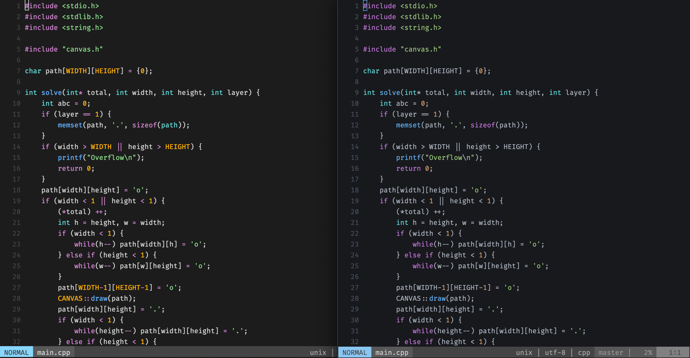

# onedark.vim
A modified version of joshdick/onedark.vim to make vim way more like base16-eighties theme on MacOS.


# Installation

If you use Plug:

```
Plug 'ukyouz/onedark.vim'
```

# Options

If you want more contrast of background:

```vim
let g:onedark_style = 'darker'
```

Or even more:

```vim
let g:onedark_style = 'deep'
```

# Updates

Support [nvim-treesitter](https://github.com/nvim-treesitter/nvim-treesitter#available-modules) for neovim version >= 0.5!

▼ **Python**, treesitter parsing *(left)* compare to normal syntax highlighting *(right)*.



▼ **C**, treesitter parsing *(left)* compare to normal syntax highlighting *(right)*.



# Troubleshoot

If color does not look good in MacOS Terminal.app, consider adding following settings:

```vim
set notermguicolors
```
